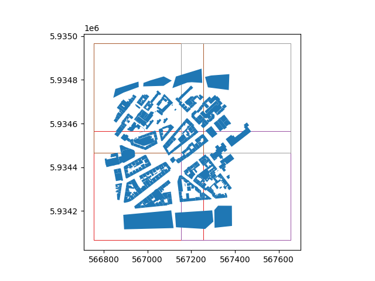
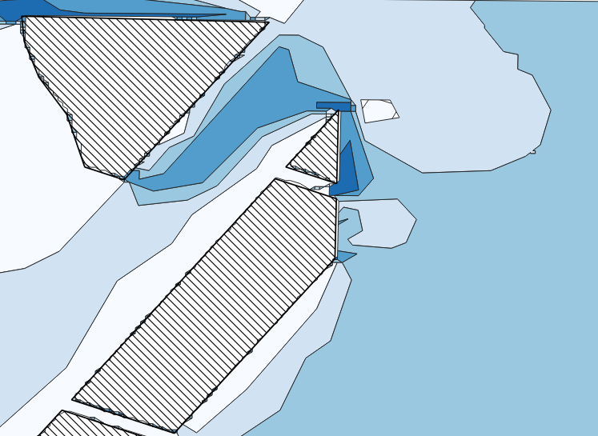

# CUT Prototype INFRARED WRAPPER API
This API wraps the INFRARED.CITY service.
It offers an OGC-API-Processes conform service, with geojson based inputs/outputs, while handling all communication with INFRARED.

In general this is a celery-based app using 3 containers each: api,worker, redis. The api container excepts requests and creates tasks in the redis db. Workers look for tasks in the redis db, calculate result and publish it in redis. Results (also cached ones) can be accessed via the api container that get’s the result from the redis db.

## Wind-Comfort AND Sunlight-Hour Simulations

### TILING
The maximum simulatable area of an INFRARED simulation is 500m*500m . 
However results in the egdes of these areas are unreliable as the simulation is unaware of the neighboring building context. 
If the total extend of the submitted buildings geojson input is less than 500m*500m the input gets simulated as 1 single tile.
Larger areas are split into overlapping bboxes. A celery-group task is created and each bbox is simulated as an independent project at INFRARED. 
Results are merged upon collection.

Example for splitting the buildings input into multiple overlapping bboxes.



### SUNLIGHT-HOURS
See SWAGGER documentation on /infrared/docs
See process description on /processes/sunlight-hours

RUN SIMULATION `@router.post("/processes/sunlight-hours/execution")`

Inputs: 
- `{"buildings": buildings }` 
with buildings as a geojson with "building_height" attribute.
example buidlings: infrared_wrapper_api/models/jsons/buildings.json

### WIND-COMFORT
See SWAGGER documentation on /infrared/docs
See process description on /processes/sunlight-hours

RUN SIMULATION `@router.post("/processes/sunlight-hours/execution")`

Inputs:
- `{
"buildings": buildings,
"wind_speed": int
"wind_direction": int
} `
with buildings as a geojson with "building_height" attribute.
example buidlings: infrared_wrapper_api/models/jsons/buildings.json
 
Example result:


#### SUNLIGHT HOURS RESULTS
Returned as geojson with each feature having a attribute "value".

| value | sunlight hours average   |
| ----- | ------------------------ |
| `0.0` | "< 1.2 h/day"            |
| `0.1` | "2.4 h/day"              |
| `0.2` | "3.6 h/day"              |
| `0.3` | "4.8 h/day"              |
| `0.4` | "6 h/day"                |
| ....
| `1.0` | "12 h/day "              |


#### Wind Comfort Result 
Returned as geojson with each feature having a attribute "value".
The "wind comfort" service predicts a plane of Lawson Criteria categories, given an input wind direction and speed. 
The returned normalised values represent categories as seen in the following table:

| value | lawson criteria category |
| ----- | ------------------------ |
| `0.0` | "Sitting Long"           |
| `0.2` | "Sitting Short"          |
| `0.4` | "Walking Slow"           |
| `0.6` | "Walking Fast"           |
| `0.8` | "Uncomfortable"          |
| `1.0` | "Dangerous"              |


## Local Dev

### Initial Setup

The `CUT Prototype Infrared Wrapper API V2` is run on `Docker`, however it is still necessary to create a `Python` virtual environment to run tests and enable linting for pre-commit hooks. Run the following command to set up your environment: 


```
$ make venv
```

This command will create a virtualenv, install all dependencies including pre-commit hooks and create a `.env` file based on `./.env.example`. 

After the command runs, make sure to adapt your `.env` file with secure secrets, etc.  If your `IDE` does not activate your virtualenv automatically, run: 

```
$ source .venv/bin/activate
```

> [!IMPORTANT]
> This repository uses `Makefile` to run commands, in case you can't use Make, just run the correspondent commands as in [this file](./Makefile).


### Running the API

To run the API: 

```
$ make start
```

After the image is built and containers initialise, you can access the following in your browser: 

| Service    | URL                                       | Access                                      |
|------------|-------------------------------------------|---------------------------------------------|
| Swagger UI | http://0.0.0.0:8002/infrared/docs         | Not password protected                       |
| Redoc      | http://0.0.0.0:8002/infrared/redoc        | Not password protected                       |
| OpenAPI    | http://0.0.0.0:8002/infrared/openapi.json | Not password protected                       |

### Tests 

To run the Docker container in interactive mode:

```bash
make test-it
```

Once the container terminal is available, to run tests: 

```bash
pytest
```

To run tests only, without interactive mode: 

```bash
make test-docker
```

### Formating/ linting code

```
$ make fmt
```

```
$ make lint
```

